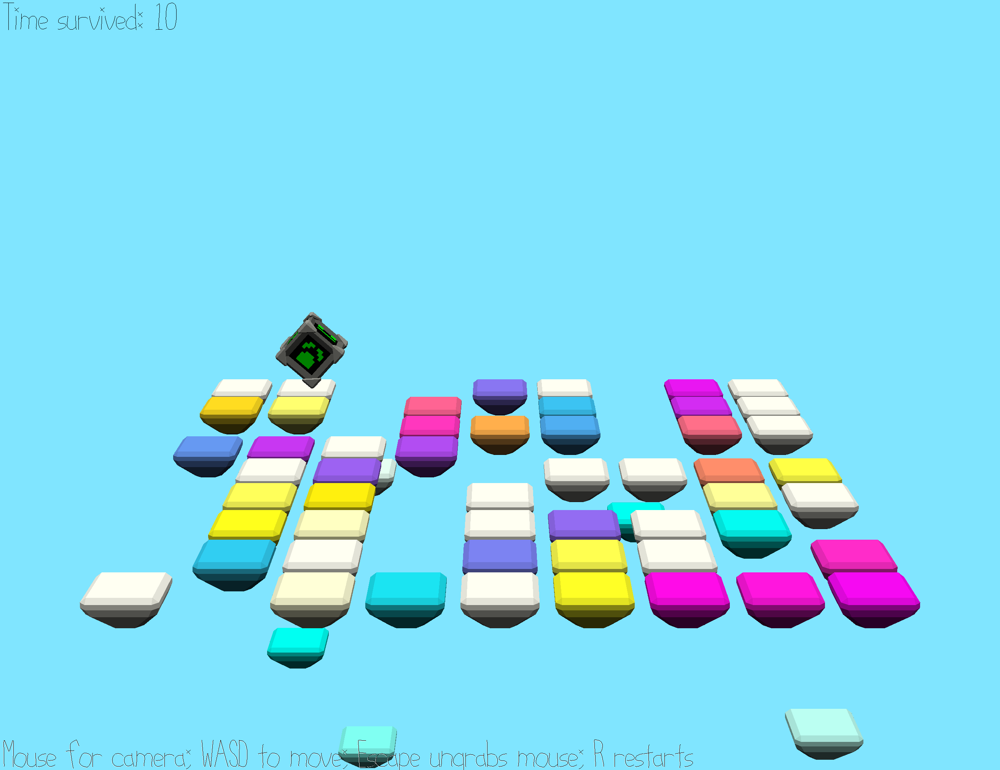

# Cube Hopper

Author: Eric Schneider

Design: This is a nice little 3D game in which you play as a cube that has to hop to safety as the floor it stands on *plummets*.
It's about the most fun I could squeeze out without collisions or physics :)

Screen Shot:

How To Play:

The ground below you will fade through a series of colors, then fall.
Your goal is to not be on a square that falls.

Move: WASD  
Camera: Mouse  
Ungrab Mouse: Esc  
Restart: R  

Sources: I made the assets myself :)  
Thanks to the Blender Foundation for making Blender, Jim McCann for his codebase that I built upon, and Pablo Wilson for letting me scream my OpenGL frustrations at him.

This game was built with [NEST](NEST.md).

